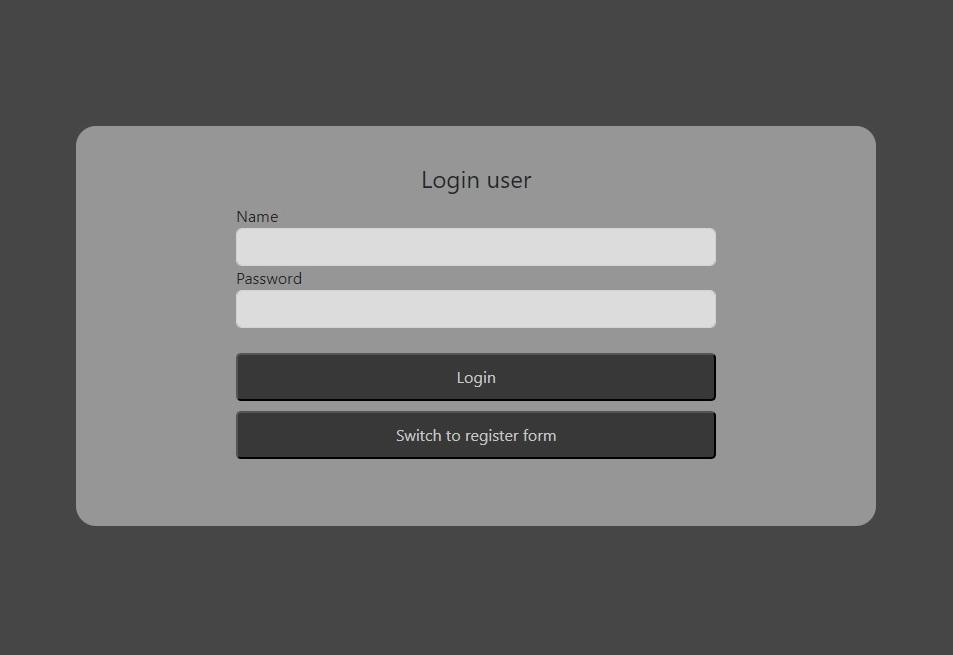
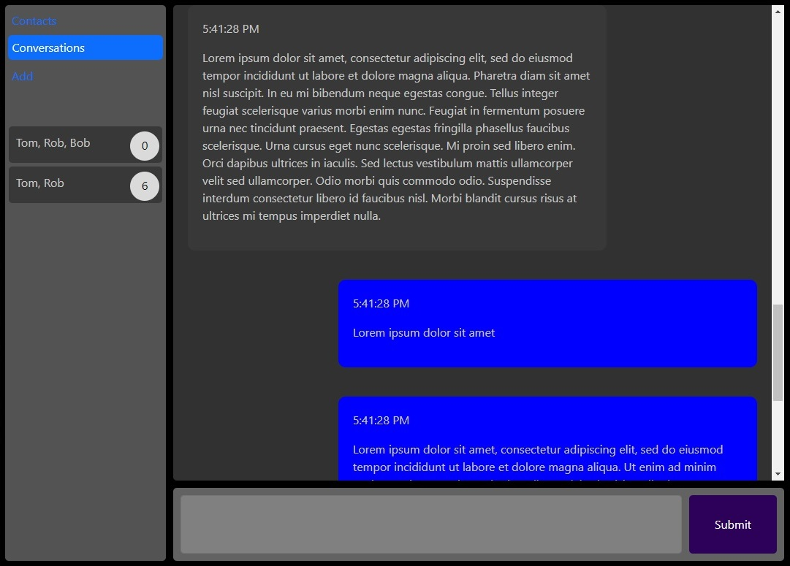
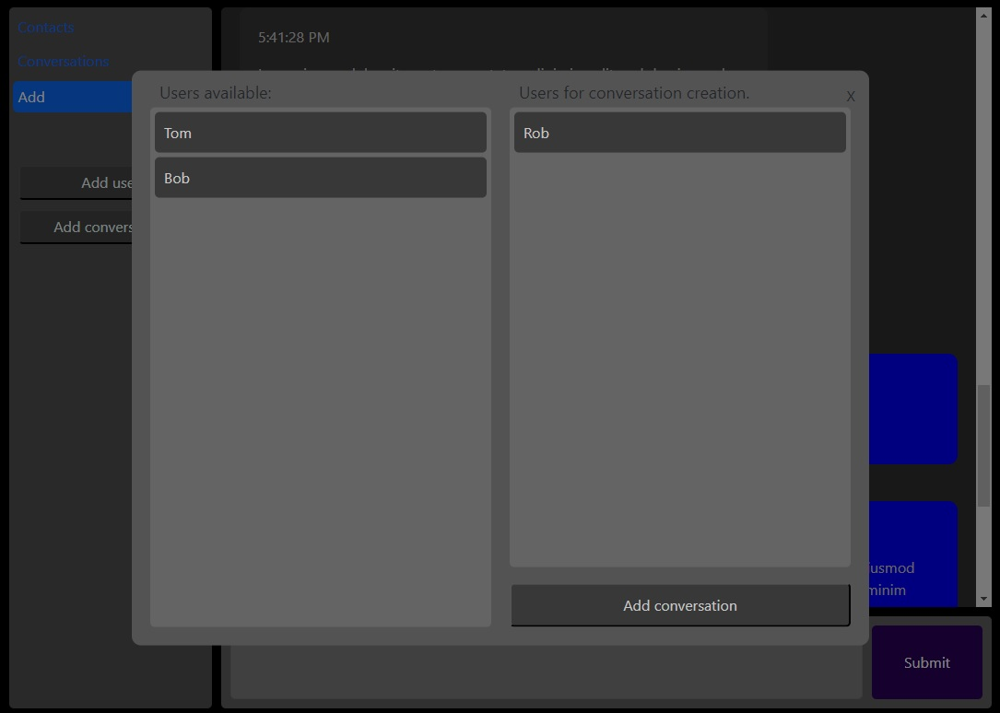

# Real-time messenger
## Description
This is project that I developed to understand how messenger application could be build.
The project utilizes Spring Boot for the server-side operations and Angular for the client-side user interface.
Client-side is put in this repository https://github.com/Luke1024/messenger-web-client
At the current stage of this project sockets are not used, it's build more like a typical webapp using REST api.
Client side is making requests to update, server push is not used in any form.

## Features
* Real-Time Messaging.
* User Authentication.
* Group chats

## Screenshots

## Status:
*this app is work in progress

## Built with
* Angular
* Spring Boot

## Contact
chajdas.lukasz@gmail.com